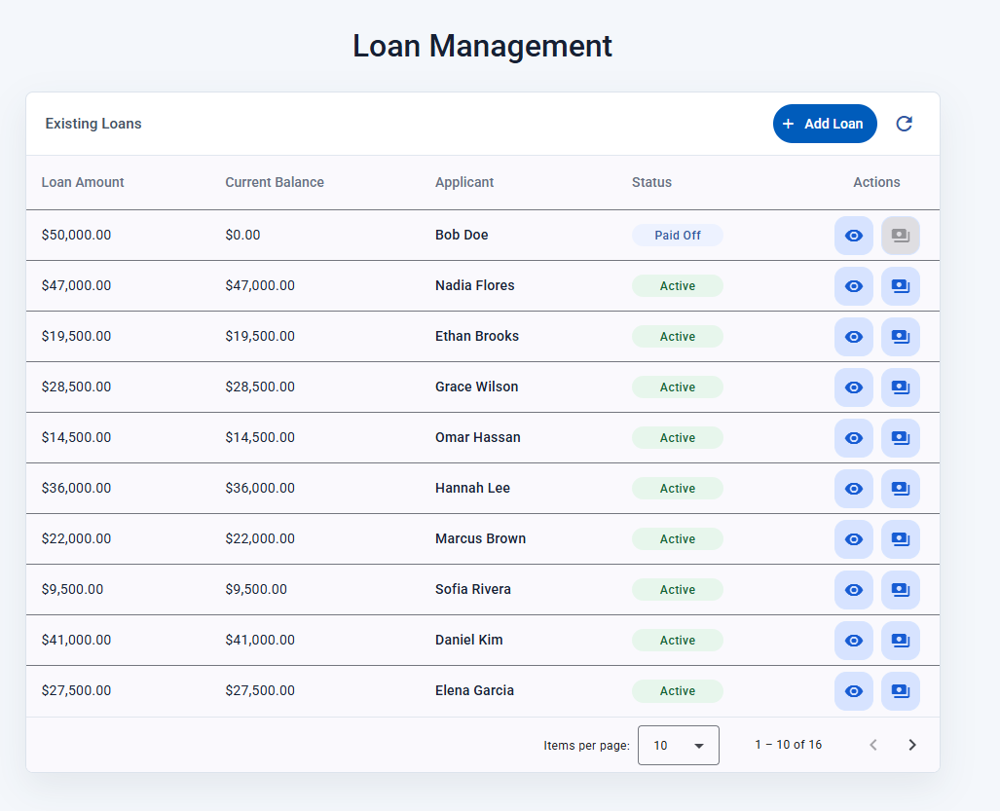
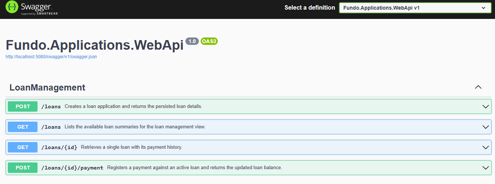

# Loan Management MVP - Implementation Summary

This repository is a fork of the original take-home test repository:
https://github.com/richardfundo/take-home-test

This fork implements the Loan Management technical task as a pragmatic fullstack MVP using .NET, Angular, EF Core, SQL Server and Docker.

The solution focuses on delivering the required loan management flow end to end:

- Create loan applications.
- List loans with pagination.
- View loan details.
- Register payments.
- Validate loan and payment inputs.
- Persist data with EF Core and SQL Server.
- Run the backend API and database with Docker Compose.
- Validate changes through GitHub Actions.




## Documentation

Detailed setup and implementation notes are available in:

- [Backend README](backend/src/README.md)
- [Frontend README](frontend/README.md)

The backend README includes API setup, Docker instructions, database notes, endpoint details, testing commands and implementation tradeoffs.

The frontend README includes Angular setup, UI structure, API integration notes and validation commands.

## Quick start

The recommended review path is:

1. Start the backend and SQL Server using Docker Compose.
2. Run the Angular frontend locally.
3. Open Swagger to inspect and test the API.
4. Open the Angular UI and validate the loan list, loan details, create loan, and payment flows.
5. Run backend tests and frontend validation commands to verify the implementation locally.

## Implementation approach

The backend uses a lightweight layered architecture:

- Domain for loan and payment rules.
- Application for DTOs, service flow and result-based error handling.
- Infrastructure for EF Core, SQL Server persistence and seed data.
- WebApi for controllers, dependency injection, Swagger and API configuration.

The frontend uses a simple Angular structure with API services, Angular Material UI and pragmatic RxJS usage for loading, refresh and error handling.

## Challenges and tradeoffs

- Authentication was intentionally left out because it was not required for the MVP and would add setup overhead without improving the core loan flow.
- The backend favors result-based application errors instead of throwing exceptions for expected validation and not-found scenarios.
- Pagination was added to the loan list to keep the API shape closer to a real-world implementation while staying simple.
- Docker Compose focuses on the backend API and SQL Server, which is the most important local review path.
- The frontend is intentionally lightweight because this assessment is backend-focused while still requiring fullstack integration.
- A minimal GitHub Actions pipeline was added to validate pull requests without turning the assessment into a full CI/CD setup.

## Features not completed

The following items are intentionally out of scope for this MVP:

- Authentication and authorization.
- Loan approval workflow.
- Amortization schedules.
- External payment provider integration.
- Advanced reporting.
- Full production deployment setup.

## Future improvements

Given more time, I would add:

- Authentication with role-based authorization.
- Optimistic concurrency for concurrent payments.
- More frontend component tests.
- API health checks.
- Better filtering and sorting for the loan list.
- Production-oriented deployment documentation.

---

# **Take-Home Test: Backend-Focused Full-Stack Developer (.NET C# & Angular)**

## **Objective**

This take-home test evaluates your ability to develop and integrate a .NET Core (C#) backend with an Angular frontend, focusing on API design, database integration, and basic DevOps practices.

## **Instructions**

1.  **Fork the provided repository** before starting the implementation.
2.  Implement the requested features in your forked repository.
3.  Once you have completed the implementation, **send the link** to your forked repository via email for review.

## **Task**

You will build a simple **Loan Management System** with a **.NET Core backend (C#)** exposing RESTful APIs and a **basic Angular frontend** consuming these APIs.

---

## **Requirements**

### **1. Backend (API) - .NET Core**

* Create a **RESTful API** in .NET Core to handle **loan applications**.
* Implement the following endpoints:
    * `POST /loans` → Create a new loan.
    * `GET /loans/{id}` → Retrieve loan details.
    * `GET /loans` → List all loans.
    * `POST /loans/{id}/payment` → Deduct from `currentBalance`.
* Loan example (feel free to improve it):

    ```json
    {
        "amount": 1500.00, // Amount requested
        "currentBalance": 500.00, // Remaining balance
        "applicantName": "Maria Silva", // User name
        "status": "active" // Status can be active or paid
    }
    ```

* Use **Entity Framework Core** with **SQL Server**.
* Create seed data to populate the loans (the frontend will consume this).
* Write **unit/integration tests for the API** (xUnit or NUnit).
* **Dockerize** the backend and create a **Docker Compose** file.
* Create a README with setup instructions.

### **2. Frontend - Angular (Simplified UI)**  

Develop a **lightweight Angular app** to interact with the backend

#### **Features:**  
- A **table** to display a list of existing loans.  

#### **Mockup:**  
[View Mockup](https://kzmgtjqt0vx63yji8h9l.lite.vusercontent.net/)  
(*The design doesn’t need to be an exact replica of the mockup—it serves as a reference. Aim to keep it as close as possible.*)  

---

## **Bonus (Optional, Not Required)**

* **Improve error handling and logging** with structured logs.
* Implement **authentication**.
* Create a **GitHub Actions** pipeline for building and testing the backend.

---

## **Evaluation Criteria**

✔ **Code quality** (clean architecture, modularization, best practices).

✔ **Functionality** (the API and frontend should work as expected).

✔ **Security considerations** (authentication, validation, secure API handling).

✔ **Testing coverage** (unit tests for critical backend functions).

✔ **Basic DevOps implementation** (Docker for backend).

---

## **Additional Information**

Candidates are encouraged to include a `README.md` file in their repository detailing their implementation approach, any challenges they faced, features they couldn't complete, and any improvements they would make given more time. Ideally, the implementation should be completed within **two days** of starting the test.
